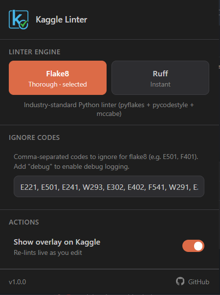
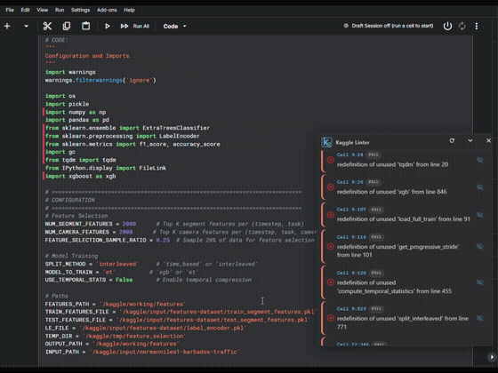
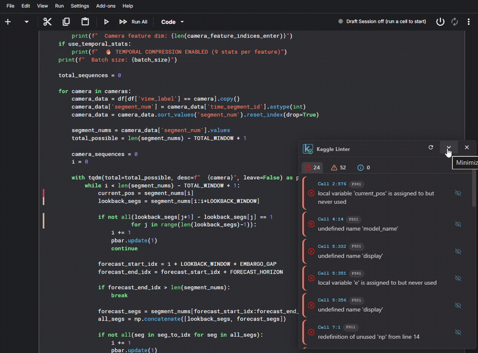

<a name="readme-top"></a>

<div align="center">

[![Contributors][contributors-shield]][contributors-url]
[![Forks][forks-shield]][forks-url]
[![Stargazers][stars-shield]][stars-url]
[![Issues][issues-shield]][issues-url]
[![MIT License][license-shield]][license-url]
[![LinkedIn][linkedin-shield]][linkedin-url]

</div>

---

# 🛠️ Kaggle Linter

**Lint your Python code right inside Kaggle notebooks — no copy-pasting into a separate tool.**
Built with ❤️ by [Chater Marzougui](https://github.com/chater-marzougui).

<br />
<div align="center">
  <a href="https://github.com/chater-marzougui/kaggle-lint">
     
  </a>
  <h3>Kaggle Linter</h3>
  <p align="center">
    <strong>Real-time Flake8 and Ruff linting for Kaggle notebooks, running entirely in your browser.</strong>
    <br />
    <br />
    <a href="https://github.com/chater-marzougui/kaggle-lint/issues/new?labels=bug&title=False+positive%3A+&body=Engine%3A+Flake8+or+Ruff+%28delete+one%29%0A%0ARule+code%3A+%0A%0ANotebook+cell+code+that+triggered+it%3A%0A%0A%0A%0AWhat+you+expected%3A%0A%0A%0AWhat+happened+instead%3A%0A">Report Bug / False Positive</a>
    ·
    <a href="https://github.com/chater-marzougui/kaggle-lint/issues/new?labels=enhancement">Request Feature</a>
  </p>
</div>

<br/>

---

<details>
  <summary>Table of Contents</summary>
  <ol>
    <li><a href="#about-the-project">About The Project</a></li>
    <li><a href="#-screenshots--demo">Screenshots &amp; Demo</a></li>
    <li><a href="#-getting-started">Getting Started</a></li>
    <li><a href="#-installation">Installation</a></li>
    <li><a href="#-usage">Usage</a></li>
    <li><a href="#-configuration">Configuration</a></li>
    <li><a href="#️-known-limitations">Known Limitations</a></li>
    <li><a href="#-contributing">Contributing</a></li>
    <li><a href="#-license">License</a></li>
    <li><a href="#-privacy">Privacy</a></li>
    <li><a href="#-contact">Contact</a></li>
    <li><a href="#-acknowledgments">Acknowledgments</a></li>
  </ol>
</details>

<div align="right">
  <a href="#readme-top">
    
  </a>
</div>

---

## About The Project

**🚀 Kaggle Linter** is a Chrome extension that brings real Python linting into Kaggle's notebook editor. Instead of finding out about an unused import or an undefined variable only when a cell fails to run, you see it flagged inline, with severity, exact line, and a one-click way to jump to it or ignore that rule going forward. It understands the whole notebook, not just the cell you're looking at, so a variable defined three cells up is correctly recognized where you use it.

### 🎯 Key Features

- 🔧 **Two linting engines, your choice**: Ruff (native WebAssembly, near-instant) or Flake8 (pyflakes + pycodestyle + mccabe, via Pyodide) — pick whichever fits how you work.
- 🧠 **Whole-notebook awareness**: cross-cell variable scoping, not per-cell isolation.
- ⚡ **Real-time feedback**: re-lints automatically as you edit, no manual trigger needed.
- 🎯 **Click-to-navigate**: click any finding to jump straight to the exact line.
- 🌓 **Theme aware**: matches your system's light/dark preference.
- 🔇 **Per-engine ignore codes**: silence the checks you don't want, with a one-click "ignore this code" action right from the error list.

<div align="right">
  <a href="#readme-top">
    
  </a>
</div>

---

## 🎬 Screenshots & Demo







<div align="right">
  <a href="#readme-top">
    
  </a>
</div>

---

## ⚡ Getting Started

### Prerequisites

Nothing to install to _use_ the extension beyond Chrome itself. Building from source needs Node.js 22+ and npm 10+ — see [CONTRIBUTING.md](CONTRIBUTING.md).

<div align="right">
  <a href="#readme-top">
    
  </a>
</div>

---

## 📦 Installation

### Chrome Web Store — coming soon

Kaggle Linter is currently pending Chrome Web Store review. Once it's approved, installing from the store will be the recommended way to get it — this section will be updated with the link.

### Manual install (current)

```bash
# Step 1: Download the latest release
# https://github.com/chater-marzougui/kaggle-lint/releases

# Step 2: Extract the ZIP file

# Step 3: In Chrome, go to chrome://extensions/, enable Developer mode,
# click "Load unpacked", and select the extracted folder.
```

Building from source instead? See [CONTRIBUTING.md](CONTRIBUTING.md).

<div align="right">
  <a href="#readme-top">
    
  </a>
</div>

---

## 📚 Usage

1. Open any Kaggle notebook in edit mode.
2. The linter initializes automatically and shows an overlay in the bottom-right corner.
3. Click any error to jump to it in the notebook.

| Shortcut       | Action                     |
| -------------- | -------------------------- |
| `Ctrl+Shift+L` | Manually re-run the linter |
| `Ctrl+Shift+H` | Toggle overlay visibility  |

<div align="right">
  <a href="#readme-top">
    
  </a>
</div>

---

## 🪛 Configuration

Click the extension icon in the Chrome toolbar to configure:

- **Linter Engine** — switch between Flake8 and Ruff.
- **Ignore Codes** — comma-separated error codes to ignore, per engine (e.g. `E501, F401`). Add `debug` to turn on debug logging without reinstalling.
- **Show overlay on Kaggle** — toggle the overlay on/off.

There's no config file or environment variable — everything is set from the popup and stored via Chrome's own `chrome.storage` sync.

<div align="right">
  <a href="#readme-top">
    
  </a>
</div>

---

## ⚠️ Known Limitations

- **Depends on Kaggle's current notebook markup.** Extraction reads Kaggle's own JupyterLab-based DOM; if Kaggle changes their notebook UI significantly, extraction may need an update. If linting stops working, please [open an issue](https://github.com/chater-marzougui/kaggle-lint/issues).
- **Flake8's first load can take up to ~30 seconds** (it's a real Python runtime compiled to WebAssembly). Ruff is near-instant by comparison — it's the default for this reason.
- **Ignore-codes aren't validated against a live rule catalog**, only checked for a plausible shape (letters + digits). A well-formed but nonexistent code is silently ignored rather than flagged as a typo.
- **Only active on notebook edit pages** (`kaggle.com/code/.../edit`), not on read-only "view" pages.
- **Theme follows your OS/browser color-scheme preference**, not a Kaggle-specific in-app toggle if Kaggle ever ships one independently of that.
- **Very large notebooks** may see a brief delay on the very first lint while Kaggle finishes loading cell content asynchronously — this resolves itself within a few seconds without any action needed.

<div align="right">
  <a href="#readme-top">
    
  </a>
</div>

---

## 🤝 Contributing

Contributions are what make the open source community amazing! Any contributions are **greatly appreciated**.

1. **Fork the Project**
2. **Create your Feature Branch** (`git checkout -b feature/AmazingFeature`)
3. **Commit your Changes** (`git commit -m 'Add some AmazingFeature'`)
4. **Push to the Branch** (`git push origin feature/AmazingFeature`)
5. **Open a Pull Request**

For the architecture, build/test setup, and coding conventions, see [CONTRIBUTING.md](CONTRIBUTING.md).

<div align="right">
  <a href="#readme-top">
    
  </a>
</div>

---

## 📃 License

Distributed under the MIT License. See [LICENSE](LICENSE) for more information.

<div align="right">
  <a href="#readme-top">
    
  </a>
</div>

---

## 🔒 Privacy

Kaggle Linter processes your notebook code entirely inside your own browser — both linting engines run locally via WebAssembly, and nothing is sent to any server. See [PRIVACY.md](PRIVACY.md) for the full policy.

<div align="right">
  <a href="#readme-top">
    
  </a>
</div>

---

## 📧 Contact

**Chater Marzougui** - [@chater-marzougui](https://github.com/chater-marzougui) - chater.marzougui@ieee.org

Project Link: [https://github.com/chater-marzougui/kaggle-lint](https://github.com/chater-marzougui/kaggle-lint)

---

## 🙏 Acknowledgments

- **[Pyodide](https://pyodide.org/)** - Python runtime compiled to WebAssembly
- **[Flake8](https://flake8.pycqa.org/)** - Industry-standard Python linting tool
- **[Ruff](https://docs.astral.sh/ruff/)** - Extremely fast Python linter, written in Rust (via `@astral-sh/ruff-wasm-web`)

<div align="right">
  <a href="#readme-top">
    
  </a>
</div>

---

**Built with TypeScript, React, and ❤️ for the Kaggle community**

[contributors-shield]: https://img.shields.io/github/contributors/chater-marzougui/kaggle-lint.svg?style=for-the-badge
[contributors-url]: https://github.com/chater-marzougui/kaggle-lint/graphs/contributors
[forks-shield]: https://img.shields.io/github/forks/chater-marzougui/kaggle-lint.svg?style=for-the-badge
[forks-url]: https://github.com/chater-marzougui/kaggle-lint/network/members
[stars-shield]: https://img.shields.io/github/stars/chater-marzougui/kaggle-lint.svg?style=for-the-badge
[stars-url]: https://github.com/chater-marzougui/kaggle-lint/stargazers
[issues-shield]: https://img.shields.io/github/issues/chater-marzougui/kaggle-lint.svg?style=for-the-badge
[issues-url]: https://github.com/chater-marzougui/kaggle-lint/issues
[license-shield]: https://img.shields.io/github/license/chater-marzougui/kaggle-lint.svg?style=for-the-badge
[license-url]: https://github.com/chater-marzougui/kaggle-lint/blob/main/LICENSE
[linkedin-shield]: https://img.shields.io/badge/-LinkedIn-black.svg?style=for-the-badge&logo=linkedin&colorB=555
[linkedin-url]: https://www.linkedin.com/in/chater-marzougui-342125299/
